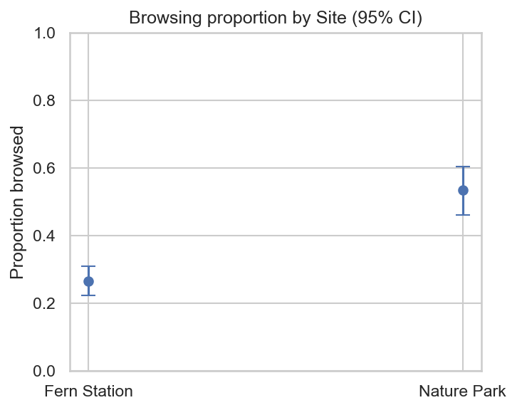
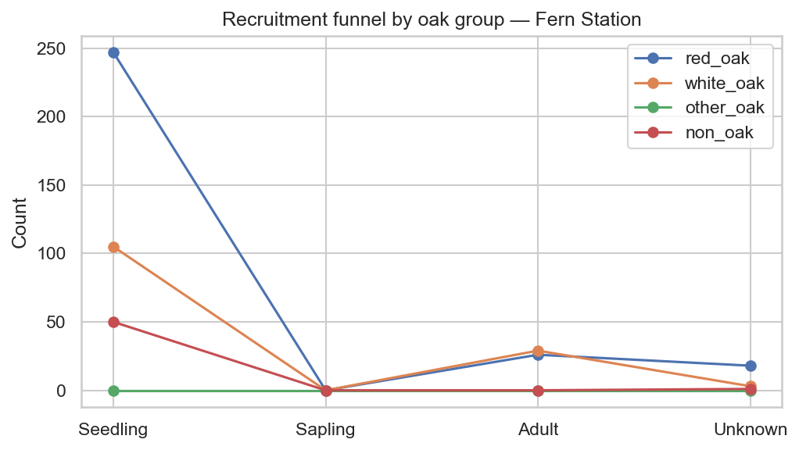
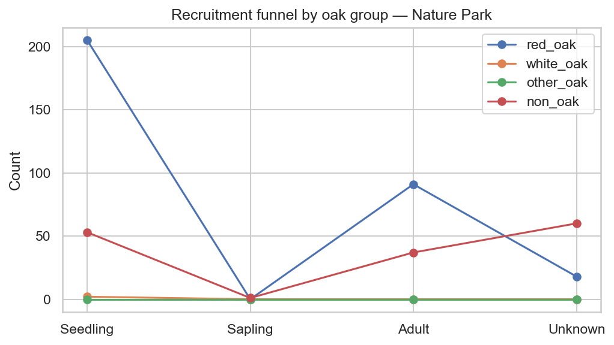

# Oak Seedling Regeneration & Browsing Analysis

## Overview
This project analyzes patterns of oak seedling regeneration across two forest sites, **Fern Station** and **DePauw Nature Park**, with a focus on seedling height structure, browsing pressure, and recruitment dynamics. Using field-collected ecological data and a reproducible Python analysis pipeline, the project explores how site-level conditions and herbivory may influence early-stage forest regeneration.

Oak regeneration is a critical component of long-term forest composition, and browsing by deer is widely recognized as a major limiting factor. This analysis provides a quantitative comparison of regeneration-related metrics between a deer-managed site (Fern Station) and a site with ambient deer pressure (DePauw Nature Park).

---

## Data
The dataset consists of **946 individual plant records** collected through field surveys. Key variables include:

- **Site** (Fern Station vs Nature Park)
- **Species**
- **Life stage** (Seedling, Sapling, Adult)
- **Height (cm)**
- **Browsing status** (binary: browsed / not browsed)
- Additional structural and environmental attributes

Data were preprocessed into a wide-format cleaned dataset prior to analysis.

---

## Methods
All analyses and visualizations were conducted in **Python**, using a reproducible, script-based workflow. Major steps included:

- Cleaning and standardizing numeric variables (height, diameter, canopy score)
- Robust parsing and normalization of browsing-status fields
- Subsetting to red oak seedlings for focused analyses
- Site-level aggregation and descriptive statistics
- Visualization using publication-style figures

**Tools & libraries:**
- pandas, numpy
- matplotlib, seaborn
- scipy, scikit-learn, statsmodels

All figures and summary tables are generated by a single script (`make_all_visualizations.py`).

---

## Results & Insights

### Red Oak Seedling Height by Site

Red oak seedling height distributions differed between sites, with Nature Park exhibiting a broader distribution and higher median height than Fern Station. These differences suggest variation in early growth conditions or post-emergence survival across sites.

---

### Browsing Proportion by Site

Browsing rates differed between Fern Station and Nature Park. Proportions were estimated using a binary browsing classification and Wilson 95% confidence intervals, providing a direct comparison of observed herbivory pressure between sites.

---

### Recruitment Structure

Recruitment funnel diagrams illustrate the relative abundance of seedlings, saplings, and adult individuals across oak groups at each site. Differences in these distributions highlight potential site-specific bottlenecks in successful regeneration.

---

## Limitations
- The analysis is observational and does not establish causation.
- Environmental covariates such as light availability and soil properties were not explicitly modeled.
- Browsing intensity was treated as binary rather than continuous.

Future work could incorporate additional field variables and multi-year data to better constrain regeneration drivers.

---

## How to Run
1. Ensure Python 3.9+ is installed.
2. Install dependencies
3. Run the visualization pipeline from the project root: python src/make_all_visualizations.py
4. Outputs will be saved to: data/processed/analysis_outputs/visualizations/

---

## Outputs

The analysis produces:

- Publication-style figures (.png)
- Summary statistics (.csv)
- Figure captions (.txt)
- A run summary (visualization_summary.txt)

All outputs are tracked in the repository for transparency and reproducibility.

---

## Project Context

This project was developed as part of a broader effort to apply data science methods to ecological field data, with an emphasis on reproducibility, interpretability, and portfolio-quality presentation.
